# Data Structures and Algorithms (Machine Learning)

These notes are currently used to refresh your knowledge and showcase the important part of each domain. I highly recommend the following materials (ordered by importance). This repository provides the notes taken from all these sources. 
- [Udacity nano degree: Data Structures and
    Algorithms](https://www.udacity.com/course/data-structures-and-algorithms-nanodegree--nd256)
- [Data Structures, Algorithms, and Machine Learning Optimization](https://www.oreilly.com/library/view/data-structures-algorithms/9780137644889/)
- [Data Structures And Algorithmic Thinking With Python](https://www.amazon.com/Data-Structure-Algorithmic-Thinking-Python/dp/8192107590)
- [Youtube playlist](https://www.youtube.com/watch?v=0IAPZzGSbME&list=PLDN4rrl48XKpZkf03iYFl-O29szjTrs_O) [If you are a begineer]
- [CLRS book](https://www.amazon.com/Introduction-Algorithms-3rd-MIT-Press/dp/0262033844) [If you are an academic].

List of problems:
- [Interview Problems + Solutions](https://github.com/ashfarhangi/Data-Structures-and-Algorithms/blob/master/Leetcode-Problems.ipynb)

Machine Learning Inteviews:
- [Cracking ML inteviews](https://github.com/shafaypro/CrackingMachineLearningInterview)
- Monday, January 24, 2022

- Machine Learning Interviews  

Practice the following:
- [Problem sets from textbook](https://www.amazon.com/Data-Structure-Algorithmic-Thinking-Python/dp/8192107590)
- [Online programming](https://leetcode.com/)

My personal experience stems from PhD courses at UCF and Udacity nanodegree: 
- [Udacity nano degree: Data Structures and Algorithms](https://www.udacity.com/course/data-structures-and-algorithms-nanodegree--nd256)
- [COT 5405: Design & Analysis Algorithms](http://www.cs.ucf.edu/~sharma/COT5405)
- [COT 6410: Computational Complexity](http://www.cs.ucf.edu/courses/cot6410/Spring2021/COT6410Spring2021.html)

## 1. Orientation to the Machine Learning Foundations Series
- [Data Structures, Algorithms, and Machine Learning Optimization](https://www.oreilly.com/library/view/data-structures-algorithms/9780137644889/)
- The foundations should be strong. By large, CS concepts are standalone (no need for linear algebra, ...)
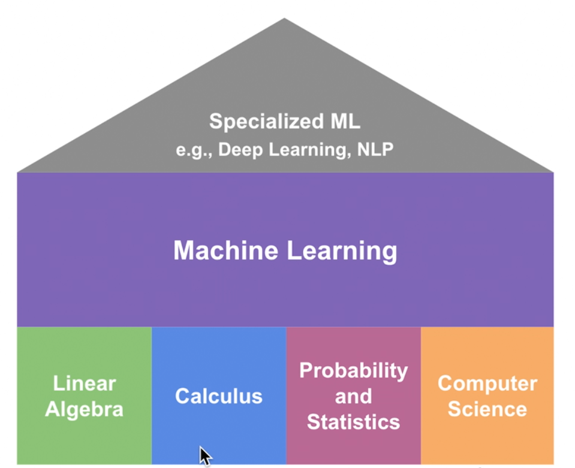
- Reasons for using DSA in ML:
	- Finding the correct DS for various situations  
	- Be thoughtful for time/space complexity in:
		- Model Training
		- Model deployment in larger scale
		- **Software 2.0:** Assuming the fixed batch size, Deep Learning algos typically have **constant time (Compute)/space(RAM)** complexity 
	- We also learn how to implement ML models as graphs 
		- Low-level PyTorch 

## 2. Big O Notion
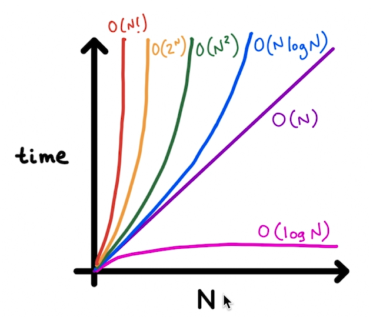

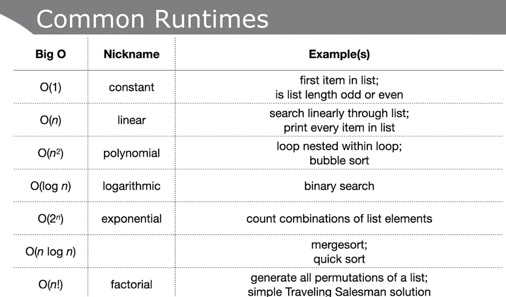
- Shipping a dataset to datacenter has constant time (e.g. 24 hours). But uploading it to server is not.
- For problems its advisable to find the best, worst and expected (average) Big O
- 
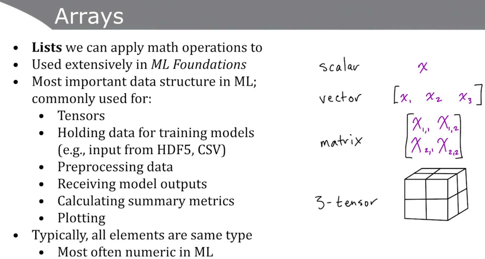

We keep the *m*. Given that in might be large.
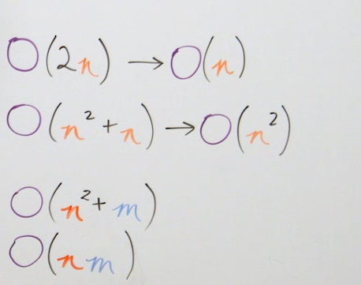
# 3. Data structures
List

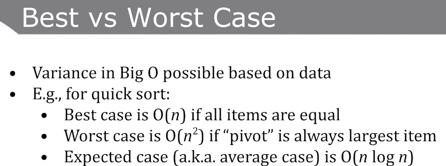

Linked lists are not indexed. Only nodes are linked toghether.
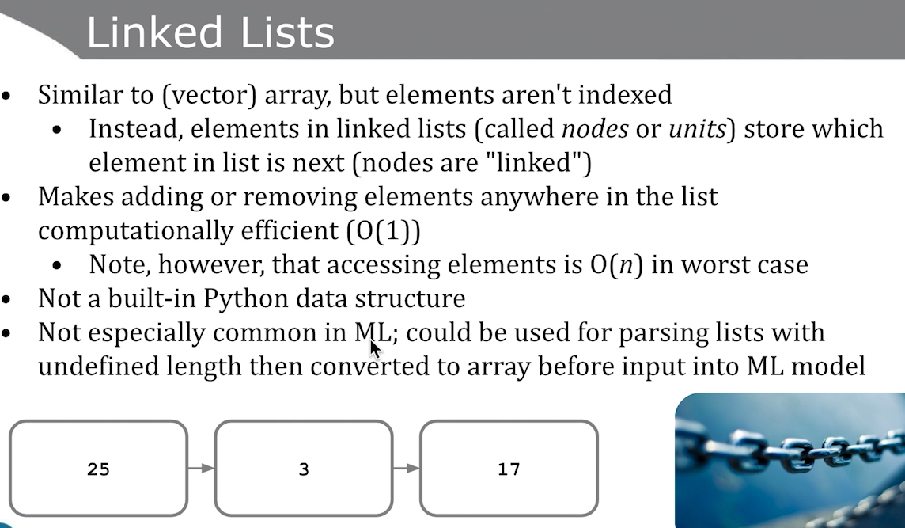

- Stacks are implemented as lists in python. s.append, s.pop
- Queue: beginning and end are available. You can also take a peek of the first one.
- Deques (دک) (Double ended- queue):
# Data Structures and Algorithms (CS)
The summary of **Data Structures and Algorithms** plus **Interview steps** from Udacity's nano degree "Data Structures and Algorithms". 

I’ve included the code for each concept in Python in the code folder. I would
suggest to implement short codes for your projects or coding interviews.

# How to solving algorithm problems:

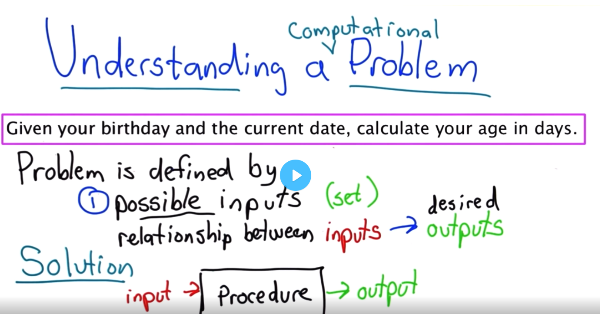

Think in simple term:

1.  What are the inputs

2.  What are the outputs

3.  Step-by-step ways that can connect the two

**Next:**

Do some examples on paper or on your mind. The trick is to find the correct **relationships** between input and output. 
Finally, you can test some cases and fine-tune your approach for special cases.

Writing the algorithm can be done by writing the _pseudocode_.

Question 1: Write an algorithm/program that returns the difference
of two dates.

**Step 1: Ask yourself the following questions**

Q: For inputs (dates), what are the valid inputs? 
Q: How input are encoded? (yyyy,mm,dd)
Q: Possible output returns? (an integer)

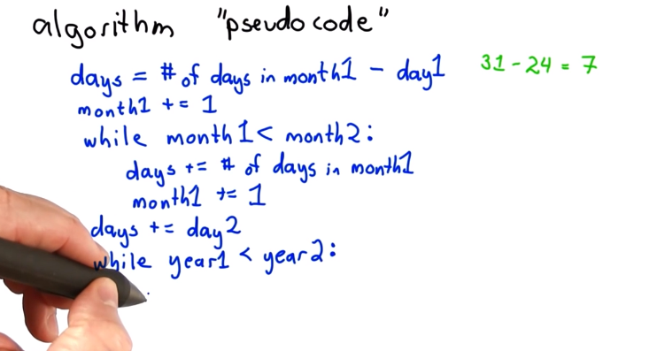

**Step 2: Write simple code that works partially for the problem** 
- Chances are, you need to consider all possible conditions. Often, this results in getting stuck in finding the perfect solutions. Hence, its advisable that you find the simplest solution that works. E,g, solve with a single simple case.

Tips:
Break into simple parts so that we can see our progress.
Write simple small codes that work
No need to figure out all the details. 

# Concepts: 
Now we look into the main topics that are being covered in most interviews/coding challenges. We also look into the patterns that appear in solutions which can be used in new problems. The goal is to understand the fundamentals and try to use them to solve problems. 

## Big O Notion:

As the input to an algorithm increases, the time required to run the algorithm
may also increase.

For example in **Nested Loops**:

` For i in range(len(n)):

        For j in range(len(n)):

Print(“hello World”) `
 
 n^2

Will increases the lines dramatically

The *rate of increase* of an algorithm is also referred to as the **order** of
the algorithm

For example, instead of saying "this relationship has a linear rate of
increase", we could instead say, "The *order* of this relationship is linear".

*O Notation*, and you'll see that the "O" in the name refers to the **o**rder of
the rate of increase.

Length of input to my function

O(2n+2) \> n=10 -\> 22

 In n\^2 + 5*n*2+5, the 55 has very little impact on the total
efficiency—especially as the input size gets larger and larger. Asking the
computer to do 10,005 operations vs. 10,000 operations makes little difference.
Thus, it is the n\^2*n*2 that we really care about the most, and the + makes little difference

Interviewer wants us to think about efficiency.

Run time analysis

O(3N) space efficiency (copying code)

Int , float 4 bytes

char 1 byte

## Comparison

Finding the smallest of n numbers:(n-1)  
Finding the biggest of n numbers:(n-1)  
Finding the smallest and the biggest of n numbers:(2n-3)

## Search
**Binary search (Middle …. Middle, O (log(n)).:**

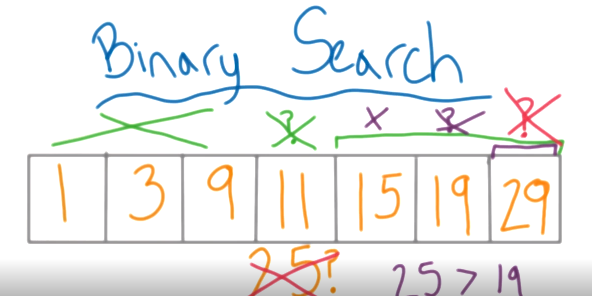

**Algorithm:** Tricks to solve a problem

**Q:** How to find number 25 in this a sorted array?

**A:**

**1. Linear search: O(n)**

**2. Binary Search:** O(log(n)+1) ( Why it is called binary search? find a
postion of binary)

Middle, Middle, Middle.

## Sorting:

**Bubble sort:**

Simplest and most inefficient one O(n\^2)

## Merge Sort (divide, merge):

Using divide and conquer, first, we divide 2 by 2

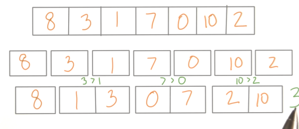

Then we compare the elements

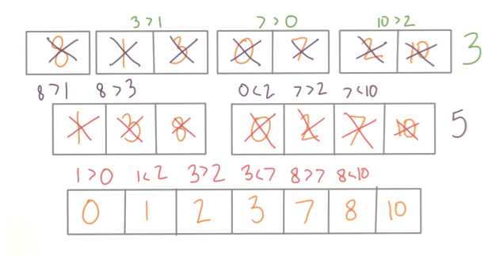

Efficiency:

O (n Log (n))

Why we are seeing log (n) in our efficiency? Hint: same as binary search problem

## Quick Sort (divide, merge):

Pick one and move it around

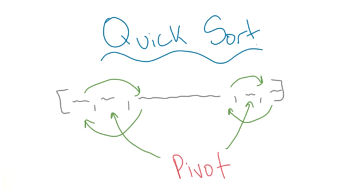

Why it can be chosen as the most efficient algorithm?

Because on average it will outperform merge sort.

On each step we are performing two moving around.

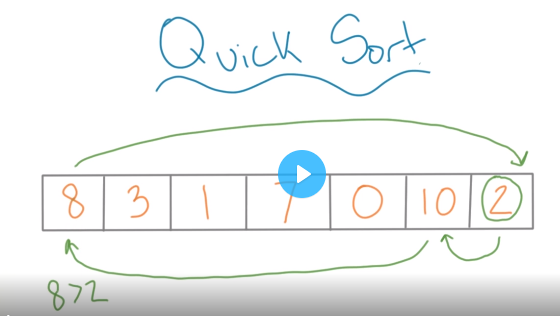

(Pivot = Last element) First move we move

1.  Select right P

2.  PL LS SP (Shift Pivot to left , Swap start and left)

3.  Compare Start with pivot. If (Start \> Pivot repeat step 2)

4.  Else move to second start

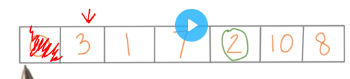

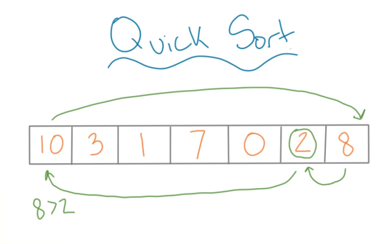

I advise to practice this for cementing the algorithm.

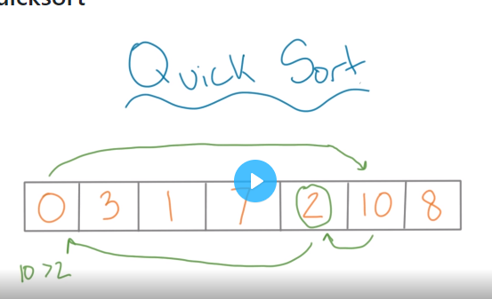

**Great no need to move the original pivot anymore (2 is at the right place)**

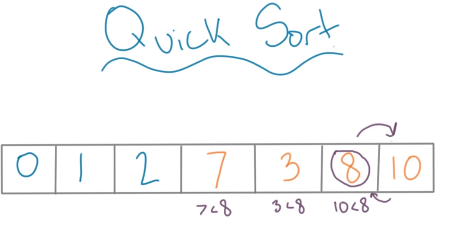

Check 2 with lefts

New pivot on right. Compare

Moving phase

Everything less than 8 and 10 sweap results in:  
Everythin less than 8 are already below 8 so cemented

**Efficiency:**

**O(n2) if it’s already sorted. Why? Wasting time**

## Dynamic programming:

(Programming == tables)

Factorial problem in python:

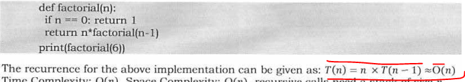

DP = **Recursion** + **Memo**-ization

Knapsack problem: Max value for weight limit

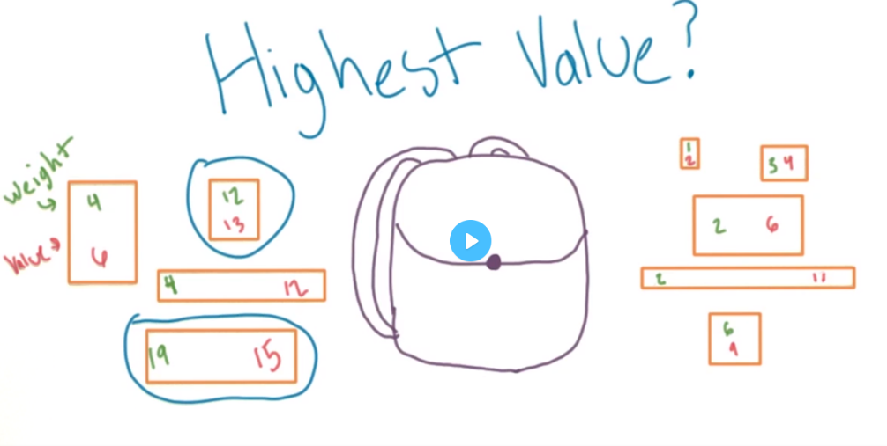

Knapsack. Imagine the skyrim world where you can carry a certain weight (50kg)
in your bag, how can you gather the most valuable items (3w,500v) with you?

How you optimize which items with their weights to carry with you?

1.  Brute force: Check all the solutions and pick the best one: O (2\^n)
    possible combinations. “exponential time”

Can we have a polynomial time algorithm? O(n\^2)

1.  Smarter approach: Initiate with smallest item (2, 6) then (5, 9). Note that
    (4, 6) will not be placed since for index 4 value 6 is larger than 5.

>   Next look at index 6. By combining smallest value (2, 6) + (4, 5) we get
>   higher value (11).

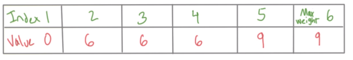

>   Figure: For each weight the maximum value we can hold.  
>   Runtime is O(nW).

1.  Dynamic programming: {can you break into sub problems}

Sub-problem: Max value for some smaller weight

We start by using Base case ( so trivial to compute)

**Base case:** Smallest computation (compute values for one object)

**+**

**Lookup table** to store the trivial cases.

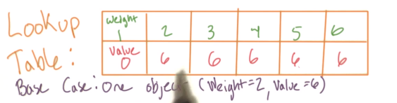

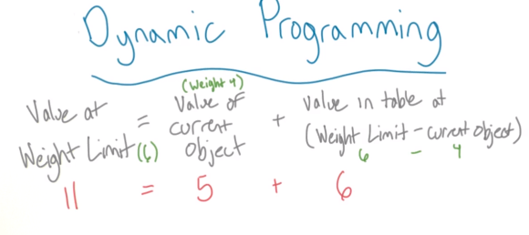

Longest common subsequent

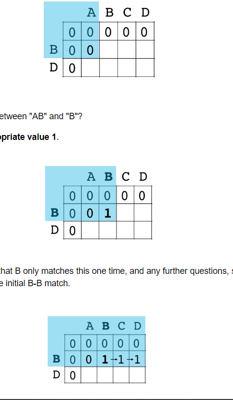

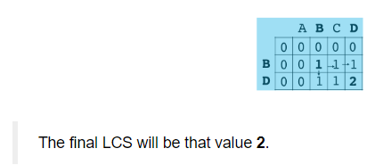

## Complexity Theory

Class P: n, n\^2,… (Any problem that can be solved in poly time)

Class NP (Non deterministic): A set of decision problems where yes can be
verified in polytime.

Descion problems (answers are yes or no) can I go from a to be less than
100miles? Lets take traveling sales man. Optimization can I do this less than
100 miles?

Is the answer more thaan 100? Yes is it lower than 200? 150? This way you will
solve the problems

Proof/verified/certificate Orlando – Atlanta – L.A

Is this number a prime 234715307129734085? Hard to check

Suppose this number not a prime? 1324 if the answer is no it can be verified
quickly

Class Co-NP: \_No\_ polytime

## Greedy Algorithm (Best option at each step):

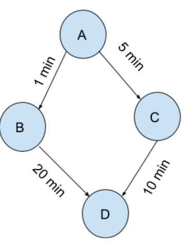

ATM machine : 1,2,10,20,50,100\<

Return: n\$ the number of bills should be minimized

21\$ = 20 +1

N= 365 – (3x100)- (1x50)-(1x10) – (1x 5)

What about Target = 8?

Example:

Min operations example {see code}: By using while, in dividing numbers in half
// == / and using

## Graph algorithm (data structure that shows relation):

Graph(Tree is a subgroup of graph,Network) Nodes(Vertex) Edges

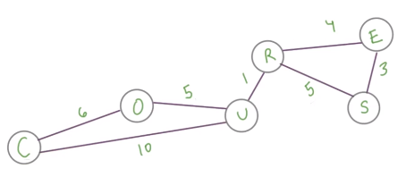

Directed (non-directed), Acyclic, Connectivity

Connectivity: You friends (social circle)

As seen below, the right graph is stronger. In contrast, the left group can be
dissolved if one of the connections drops.

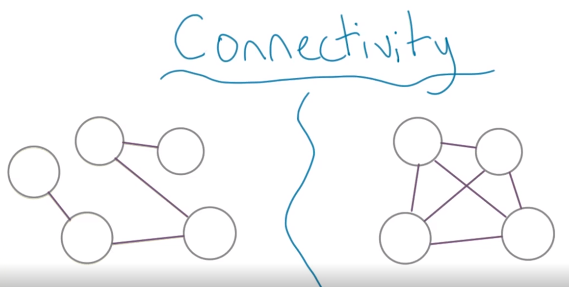

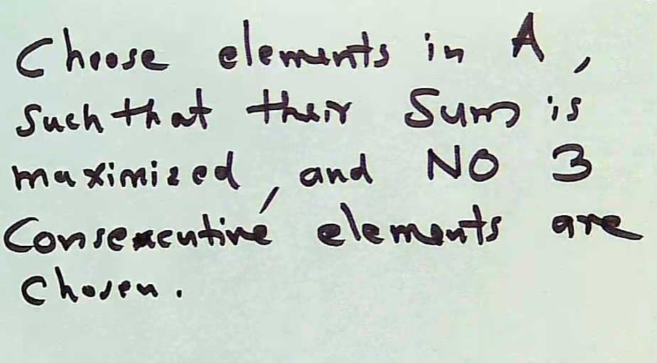

Go through array reccursavley.

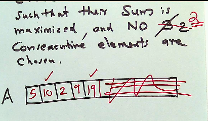

Let’s define 3 variables

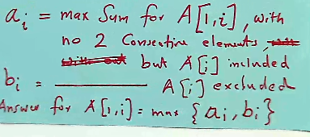

Final answer we be the best solution out of these both (A[i] B[i] )

# Technical Interview (CIOT BRCD) (cute bird)
Now lets focus on the technical interviews. We tend to simplify the concepts by using memory palace techniques. I adivse everyone to develop a memory palace for algorithms/techniques that requrie knowledge about more than 6-7 steps.

What are the most important 7 steps?

Imagine a cute bird sees a giant worm that is shaped like a Q
{Question}. First the bird pour water on the worm (clarify). Then it find the
tail and head (I, O). Then it will taste the worm (Test). It will use its brain
to decide how to eat it (Brainstorm). Then a big white eagle comes and its needs
to calculate the runtime of eating the worm {Runtime analysis}. Then it will
start eating it with If, For, {Code} and Debugs it (No more bug).

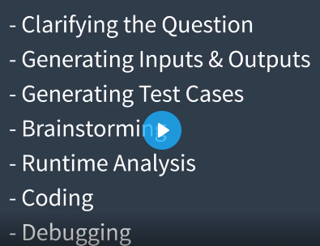

The context should be asking questions and brainstorm at first. As you go on you
rather than asking question everystep you must make statements and justify them.

{so we can have null input like [] Is that right?} { I have a feeling that it
might be useful in future steps}

Example: So it contains integers right? So Null input is another input that we
can have.

Q:  
A: Thanks it’s a pleasure to do interview with you. {Positive mindset} {Don’t
give up}

1.  **Clarifying the question {To prove you wont dive into the problem without
    learning more about it}**

Q: Given a 2D matrix of m, Just 0 and 1. Count the number of islands in the
matrix [island is a group of 1 or just 1 by itself.]

A: ok so, we are given a 2D matrix which will look something like this.:

[[1,0,1],[1,1,1)

So, our goal is find the number of islands. Is the outcome the number? Or X? So
if the are connected (I[1,0,0],[0,1,0],[0,0,1]) diagonally? Does that consider
an island?

So what we supposed to do is to find the number of

{Just want to check Im solving the right problem…}

1.  Generating inputs and outputs:

>   So my input is matrix of 0 s, 1 s (Integers, strings? No)

>   Output: Integer (\# of islands) (1s or group of ones)

1.  Generating test cases:

>   {So just to test some cases {Special}}

>   {Can we get Is it ok we have }? Yes

Q: number of island in a matrix 

**1.Clarify the question **

A[[1,0,0),[1,1,0){Just to make sure I’m solving the right problem….}

**2.Generating input/output**

\<\<\<\<\<\<\< HEAD 1. Generating input/output

Input matrix of integers 

Output integers ( number of islands 0- max{n}) 

1.  {Trick \#1 you can always answer the null case to interviewer.}{ I have a
    feeling that it might be useful in future steps} **Test cases** [**Edge
    cases**] [ Possible weird inputs that we have to handle A or none object 

{Null - empty- Write a code that doesnt crash}

1.  **Brainstorming** So if we have null, for sure we have 0 so there would be
    no islands in this case. ======= Input matrix of integers.Output integers
    (number of islands 0- max{n}) 

**3.Test cases**: {Trick \#1 you can always answer the null case to
interviewer.}{ I have a feeling that it might be useful in future steps} **Test
cases** [**Edge cases**] [ Possible weird inputs that we have to handle A or
none object.

{Null - empty- Write a code that doesnt crash}

**4.Brainstorming:** {Variables that needs to initialized} {so I need to track
X} {And keep tracking} {Runtime error} {Data structure brainstorm algorithms and
data structures} {Represent graph DFS problem} So if we have null, for sure we
have 0 so there would be no islands in this case. \>\>\>\>\>\>\>
600e13278473db6cc40a022e79c37c0e0baa2b56

But also we can have this as input (the input she wants)   {So what I am
thinking here} is start at the first element . So i need a counter **variable**
and I **initialze** it there. And **increment** it by 1.

We get to Zero. Thats not part of any island so I need to keep track of X.
Hmmmm. Maybe I can look at the elements on top and bottom and check if they are
on the same island and keep track of it. Since there is no above that. We get a
run time error. Maybe it could a case of data structure we can solve this. {This
might be a breath first search problem. I can look at the elements around it.
**Set to mark** as **visited** and **keep going**

**If you are stuck?** This represent a type of data structure and algorithm .
Merge sort maybe… Keep talking

**5. Runtime anaylsis **

When I’m looking all the elements in matrix I’m looking at them atlease once so
I’m thinking the runtime would be nXm where N is the number of rows and M is the
number of columns. Well it seems like the optimal solution. So i think i start
and jump on coding now.

**6.Coding**

So I’m calling my mainfunction islandCounter():

Variable a,b,c If() While() For()

**7.Debugging**

Test cases: input None -\> return 0 so its working

So [[1,0,1],[1,1,0). Go ahead, that looks good. Now I’m adding both of these.
And I probably {} O looks like I forget to {add a return} Looks like it works.

Python programming:
===================

\<\<\<\<\<\<\< HEAD while(len(q)!= 0):

**6. Debug:**

And run it by

{oh looks like I forget to}

Looks like it works.

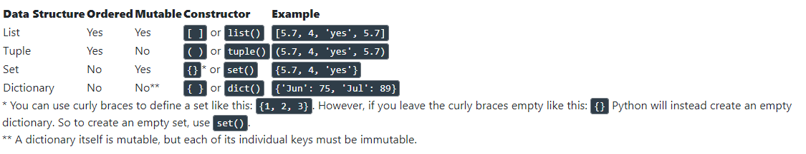

