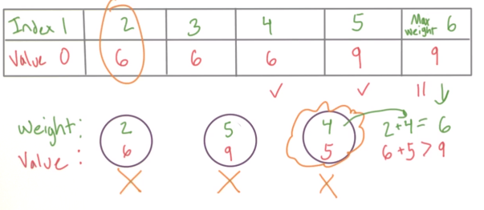

# Data Structures and Algorithms

These notes can be used to find top patterns for each category of questions and concepts. Note that reading these notes can be much faster than watching videos. Also, it can be used to refresh your knowledge or understand the important parts of each pattern. This repository provides the key information presented from all these sources:

-  [Udacity nano degree: Data Structures and Algorithms](https://www.udacity.com/course/data-structures-and-algorithms-nanodegree--nd256)
-  [Data Structures and Algorithmic Thinking With Python](https://www.amazon.com/Data-Structure-Algorithmic-Thinking-Python/dp/8192107590)
-  [Data Structures, Algorithms, and Machine Learning Optimization](https://www.oreilly.com/library/view/data-structures-algorithms/9780137644889/) [If you are interested in ML]
-  [Bari's YouTube playlist](https://www.youtube.com/watch?v=0IAPZzGSbME&list=PLDN4rrl48XKpZkf03iYFl-O29szjTrs_O) [If you are a beginner]

# 1. Foundation
-   By large, CS concepts can be standalone. However, you might need to build upon other elements. For instance, in ML, there is a need for Linear Algebra, Calculus, and Statistics.

-   Reasons for using DSA in ML:
    -   Finding the correct DS for various situations
        -   Be thoughtful for time/space complexity in:
            -   Model Training
            -   Model deployment on a larger scale

Source: [Data Structures, Algorithms, and Machine Learning Optimization](https://www.oreilly.com/library/view/data-structures-algorithms/9780137644889/)
# 2. Big O Notion

The *rate of increase* of an algorithm is also referred to as the **order** of the algorithm

For example, instead of saying "this relationship has a linear rate of increase", we could instead say, "The *order* of this relationship is linear".

*O Notation*, and you'll see that the "O" in the name refers to the **o**rder of the rate of increase.

-   Manually shipping a dataset stored in a hard drive to a data center has constant time (e.g. 24 hours). But uploading it to a server is not (route problems, encryption)
-   For many problems, it's advisable to find the worst, best, and average Big O runtime complexity

We keep the *m*. Given that it might be large. 

# 3. Data structures

- Common data structures:

- Big O notion

Linked lists are not indexed. Only nodes are linked together. 

-   Stacks are implemented as lists in Python. s.append, s.pop
-   Queue: beginning and end are available. You can also take a peek at the first one.
-   Deques (Double ended- queue):

# 4. Algorithms

The summary of **Data Structures and Algorithms** plus **Interview steps**.

## Solution to any problems
Take a look at a simple question like below:
Question 1: Write an algorithm/program that returns the difference of two dates.

**Step 1: Ask yourself the following questions**

Q: For inputs (dates), what are the valid inputs? Q: How input are encoded? (yyyy,mm,dd) Q: Possible output returns? (an integer)

**Step 2: Write simple code that works partially for the problem**

-   Chances are, you need to consider all possible conditions. Often, this results in getting stuck in finding the perfect solutions. Hence, it's advisable that you find the simplest solution that works. E,g, solve with a single simple case.

Tips: Break into simple parts so that we can see our progress. Write simple small codes that work No need to figure out all the details.

Now we look into the main topics that are being covered in most interviews/coding challenges. We also look into the patterns that appear in solutions that can be used in new problems. The goal is to understand the fundamentals and try to use them to solve problems.

## Binary Search
What are time complexity of the following problems?  
Finding the smallest of n numbers?  

	• Answer: O(n-1) ~ O(n)
 
Finding the biggest of n numbers? 

	• Answer: O(n-1) ~ O(n)
 
Finding the smallest and the biggest of n numbers?

	• Answer: O(2n-3) ~ O(n)
**Q:** How to find number 25 in this a sorted array?
**A:**

**1. Linear search: O(n)**

**2. Binary Search:** O(log(n)+1) ( Why it is called binary search? find a postion of binary)

## Sorting

**Bubble sort:**

Simple but not efficient 
T: $$O(n\^2)$$
S: O(1)

 **Merge Sort:**

Divide and Conquer: First, we divide 2 by 2

Second, we compare the elements and join the elements

Efficiency:

O (n log (n))

**Q:** Why we are seeing log (n) in our efficiency? Hint: same as the binary search problem

**Efficiency:**

O(n2) if it’s already sorted. Why? Wasting time

## Dynamic Programming

(Programming == tables)

The factorial problem in Python:

DP = **Recursion** + **Memo**-ization

Knapsack problem: Max value for weight limit

Knapsack. If you have to carry a weight (50kg) in your bag, how can you gather the most valuable items (e.g., 3 as the weight,500 as the value) with you?

How do you optimize which items with their weights to carry with you?

1.  Brute force: Check all the solutions and pick the best one: O (2\^n) possible combinations. “exponential time”

Can we have a polynomial time algorithm? O(n\^2)

1.  Smarter approach: Initiate with smallest item (2, 6) then (5, 9). Note that (4, 6) will not be placed since for index 4 value 6 is larger than 5.

>   Next look at index 6. By combining smallest value (2, 6) + (4, 5) we get higher value (11).

>   Figure: For each weight the maximum value we can hold.  
>   Runtime is O(nW).

1.  Dynamic programming: {can you break into sub problems}

Sub-problem: Max value for some smaller weight

We start by using Base case ( so trivial to compute)

**Base case:** Smallest computation (compute values for one object)

**+**

**Lookup table** to store the trivial cases.

Longest common subsequent

## Greedy Algorithm
The best option at each step might not lead to the best results.

## Graph Algorithm
Graph is a data structure that is mostly used to shows relations.

Directed (non-directed), Acyclic

The notion of connectivity: As seen below, the right graph is stronger. In contrast, the left group can be dissolved if one of the connections drops.

# 6. Practice Problems
DSA problems:
-   [Algorithmic Thinking](https://www.amazon.com/Data-Structure-Algorithmic-Thinking-Python/dp/8192107590)
-   [LeetCode](https://leetcode.com/)

Machine Learning:
-   [Cracking ML inteviews](https://github.com/shafaypro/CrackingMachineLearningInterview)
-   [Machine Learning Interviews](https://github.com/khangich/machine-learning-interview)
- -   [Interview Problems for ML engineers](https://mlengineer.io/common-leetcode-questions-by-categories-532b301130b)
-   [Interview Problems + Solutions](https://github.com/ashfarhangi/Data-Structures-and-Algorithms/blob/master/Leetcode-Problems.ipynb)

The following sources can be used for academia and research:
-   [CLRS book](https://www.amazon.com/Introduction-Algorithms-3rd-MIT-Press/dp/0262033844) 
-   [COT 5405: Design & Analysis Algorithms](http://www.cs.ucf.edu/~sharma/COT5405)
-   [COT 6410: Computational Complexity](http://www.cs.ucf.edu/courses/cot6410/Spring2021/COT6410Spring2021.html)

## Archive:
**Complexity Theory**## 

Class P: n, n\^2,… (any problem that can be solved in polytime)

Class NP (Nondeterministic):

Class Co-NP: \_No\_ polytime

**Quick Sort:**
The idea is to use pivots to sort the array.

On each step we are performing two moving around.

(Pivot = Last element)

1.  Select the rightmost element as the pivot
2.  Shift Pivot to left by one element
3.  Swap start and left
4.  Compare Start with pivot. If (Start \> Pivot repeat step 2)
5.  Else move to second start

Why it can be chosen as the most efficient algorithm?

Because on average it will outperform merge sort.

**Great no need to move the original pivot anymore (2 is at the right place)**

Check 2 with lefts

New pivot on right. Compare

Moving phase

Everything less than 8 and 10 sweep results in:  
Everything less than 8 is already below 8

